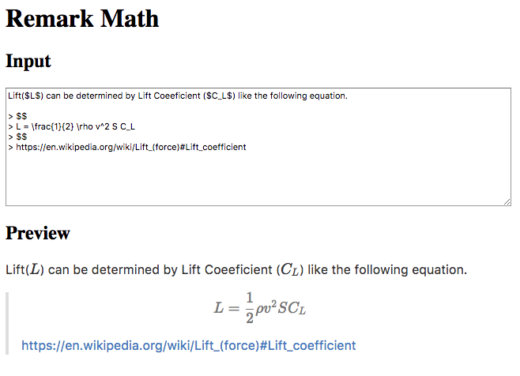
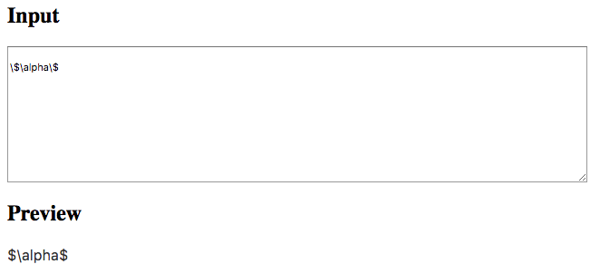
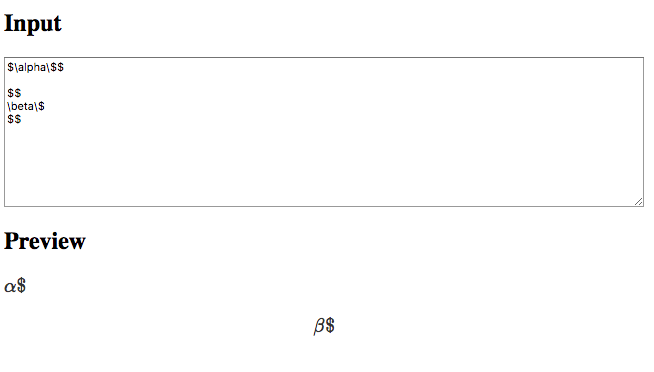
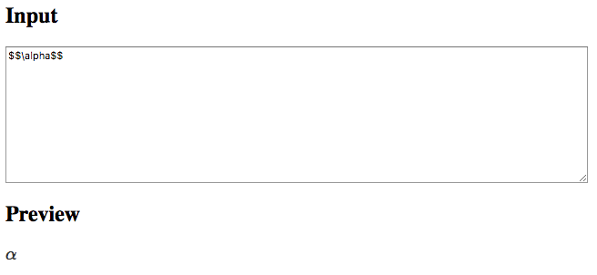

# Remark Math

[](https://www.npmjs.com/package/remark-math)
[](https://travis-ci.org/Rokt33r/remark-math)

Add math inline and block syntax to Remark

## What does Remark Math?

Remark Math parses `$` for math inline and `$$` for math block.



#### Raw string

```
Lift($L$) can be determined by Lift Coeeficient ($C_L$) like the following equation.

$$
L = \frac{1}{2} \rho v^2 S C_L
$$
```

#### Parsed Abstract Syntax Tree(Omitted)

```js
{
  type: root
  children: [
    {
      type: paragraph,
      children: [{
        type: 'text',
        value: ''
      }]
    },
    {
      type: 'math',
      children: [{
        type: 'text',
        value: 'L = \frac{1}{2} \rho v^2 S C_L'
      }]
    }
  ]
}
```

#### Result HTML string (If you choose [KaTeX][katex])

```html
<p>
  Lift(<span class="math-inline"><span class="katex">...</span></span>) can be determined by Lift Coeeficient (<span class="math-inline"><span class="katex">...</span></span>) like the following equation.
</p>
<div class="math-block">
  <span class="katex">...</span>
</div>
```

## Usages

There are two examples for server-side([`examples/nodejs`](examples/nodejs)) and browser-side([`examples/webpack`](examples/webpack), via webpack).

```js
const remark = require('remark')
const html = require('remark-html')
const math = require('remark-math')
const katex = require('katex')

const opts = {
  katex,
  inlineProperties: {
    className: 'math-inline'
  },
  blockProperties: {
    className: 'math-block'
  }
}

const processor = remark().use(math, opts).use(html)

// https://en.wikipedia.org/wiki/Lift_(force)#Lift_coefficient
const rawString = `Lift($L$) can be determined by Lift Coeeficient ($C_L$) like the following equation.

$$
L = \\frac{1}{2} \\rho v^2 S C_L
$$
`

// Raw string => AST
const parsedAST = processor.parse(rawString)
// AST => HTML string
const renderedString = processor.stringify(parsedAST)

// Or you can directly process the markdown string
// const renderedString = processor.process(rawString).toString()

console.log(renderedString)
```

### Using only math inline(or math block)

Access separate processors via `remark-math/inline` and `remark-math/block`

```js
const remark = require('remark')
const html = require('remark-html')
const katex = require('katex')

const mathInline = require('remark-math/inline')
// const mathBlock = require('remark-math/block')

const opts = {
  katex,
  inlineProperties: {
    className: 'math-inline'
  }
}

const processor = remark().use(mathInline, opts).use(html)
```

## API

### `remark.use(math[, options])`

#### `options.katex` (Optional)

KaTeX renderer

#### `options.blockProperties` (Optional)

Properties for math block

#### `options.inlineProperties` (Optional)

Properties for math inline

## Specs

### Escaped Dollars

Dollar signs can be escaped by back slash, `\`.

```
\$\alpha\$
```



### Escaped dollars in math block/inline ([Super factorial](https://en.wikipedia.org/wiki/Factorial#Superfactorial))

```
$\alpha\$$

$$
\beta\$
$$
```



### Double dollars in inline

Some TeX packages and Markdown processors use double dollars, `$$`, as a inline token. Remark Math will parse it also properly.

```
$$\alpha$$
```




## CAUTION

This library is REQUIRED `remark-parse@`**`>=2.3.0`** as a peer dependency.

> For your information [wooorm/remark#232](https://github.com/wooorm/remark/issues/232)

You can check which version you are using by the following command.

```sh
npm ls remark
```

If you don't know how to fix, I recommend you to use `remark-parse` directly.

First, remove `remark` and install `remark-parse` and `unified`

```sh
npm rm -S remark
npm i -S remark-parse unified

# Optional
npm i -S remark-stringify
```

Then, rewrite `remark` like the following.

```js
// Before
const remark = require('remark')

// After
const unified = require('unified')
const parse = require('remark-parse')
// const stringify = require('remark-stringify')

function remark () {
  return unified()
    .use(parse)
    // .use(stringify)
}
```

## License

MIT © Junyoung Choi

[katex]: https://github.com/Khan/KaTeX
